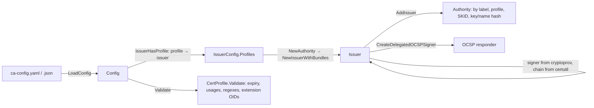
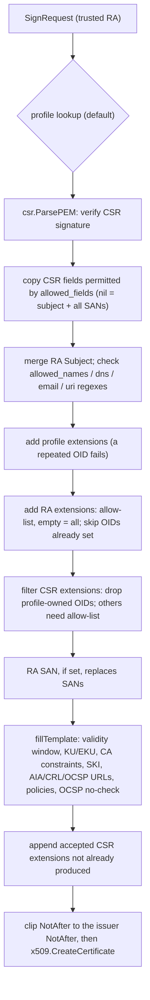

# authority package

In-process Certification Authority: configuration and profiles, issuers,
certificate signing (`Issuer.Sign`), OCSP signing and root bootstrap. See
[`Documentation/api/authority.md`](../Documentation/api/authority.md) for the
API and [`Documentation/codemap.md`](../Documentation/codemap.md) for
invariants.

## Configuration flow

A profile attaches to an issuer as follows (`issuerHasProfile`):

| Profile `issuer_label` | Issuer `allowed_profiles` empty | Issuer `allowed_profiles` populated |
| ---------------------- | ------------------------------- | ----------------------------------- |
| the issuer's label     | attached                        | attached only if listed             |
| `"*"` (wildcard)       | not attached                    | attached only if listed             |
| another label          | not attached                    | not attached                        |

With a single issuer, profiles without `issuer_label` take that issuer's label.
A populated `allowed_profiles` must include the issuer's
`aia.delegated_ocsp_profile`, otherwise `LoadConfig` fails.

## Signing pipeline

`Issuer.Sign(csr.SignRequest)` treats the **SignRequest** as coming from a
trusted registration authority (RA) and the **CSR** as untrusted.

`x509.CreateCertificate` lets `ExtraExtensions` override the extensions it
would build from template fields (KU, EKU, basic constraints, SKI/AKI, SAN,
AIA, CRL DP). A kept raw extension for one of those OIDs, whether from the
profile `extensions` or an allow-listed SignRequest, therefore replaces the
value derived from the profile. The CSR rules below exist for that reason.

### Where each extension comes from

| Extension                                             | Profile                                    | SignRequest (trusted)             | CSR (untrusted)                                                   |
| ----------------------------------------------------- | ------------------------------------------ | --------------------------------- | ----------------------------------------------------------------- |
| Key usage `2.5.29.15`, EKU `2.5.29.37`                | `usages` (or raw `extensions`)             | if allow-listed; overrides        | never                                                             |
| Basic constraints `2.5.29.19`                         | `ca_constraint`                            | if allow-listed; overrides        | never (also stripped by `csr.Parse`)                              |
| SKI `2.5.29.14`, AKI `2.5.29.35`                      | computed from the keys                     | if allow-listed; overrides        | never                                                             |
| SAN `2.5.29.17`                                       | built from permitted names                 | `SAN` field or allow-listed raw   | never as raw; names via `allowed_fields` and regexes              |
| OCSP no-check `1.3.6.1.5.5.7.48.1.5`                  | `ocsp_no_check` (wins)                     | if allow-listed                   | never                                                             |
| Certificate policies `2.5.29.32`                      | `policies` (wins)                          | if allow-listed                   | if allow-listed and neither the profile nor the SignRequest sets it |
| AIA `1.3.6.1.5.5.7.1.1`, CRL DP `2.5.29.31`           | issuer `aia` URLs                          | if allow-listed; overrides        | if allow-listed and the issuer generates none                     |
| any other OID                                         | raw `extensions` (wins)                    | if allow-listed                   | if allow-listed                                                   |

- **Allow-list.** `allowed_extensions` empty: all SignRequest extensions are
  allowed and no CSR extensions are. A disallowed extension fails the request.
  With the issuer's `omit_disabled_extensions`, it is dropped instead.
- **Profile-owned OIDs.** "never" rows are dropped silently from the CSR even
  when allow-listed.
- **Precedence per OID.** The issued certificate has exactly one extension per
  OID. Raw extensions are kept in the order profile `extensions`, SignRequest,
  CSR; the first one for an OID wins. Profile `policies` and `ocsp_no_check`
  then replace any raw copy. For the other template-built OIDs a kept raw
  extension overrides the profile-derived value, as the table shows.

### Validity

| Request                  | Result                                                                  |
| ------------------------ | ----------------------------------------------------------------------- |
| no times                 | NotBefore = now (rounded to a minute) − `backdate` (default 5m); NotAfter = NotBefore + `expiry` |
| explicit NotBefore       | must be ≥ now − `backdate`; a future NotBefore is allowed              |
| explicit NotAfter        | must be after NotBefore, and NotAfter − NotBefore ≤ `expiry`            |
| beyond the issuer        | NotAfter is clipped to the issuer NotAfter; fails if nothing remains   |

Invalid windows are rejected, never adjusted. A profile without `expiry`
(only possible when added without `Validate`) needs an explicit NotAfter and
has no lifetime bound.
